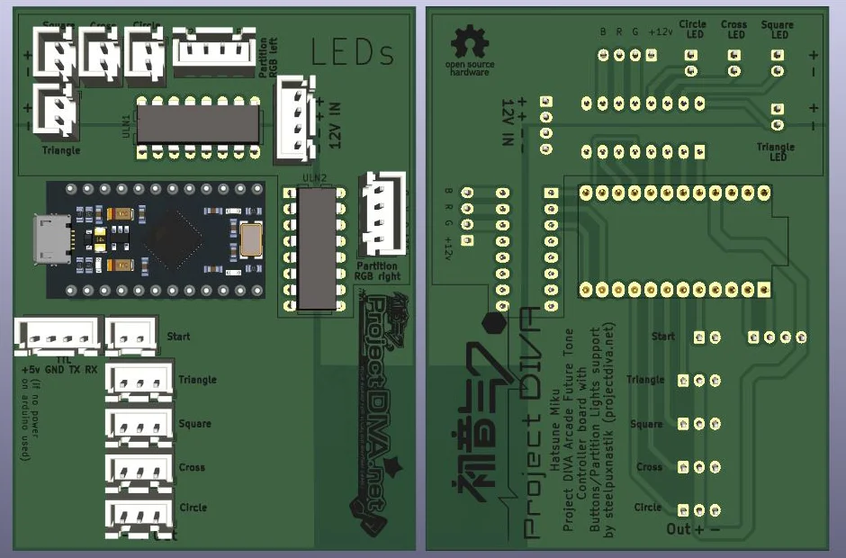
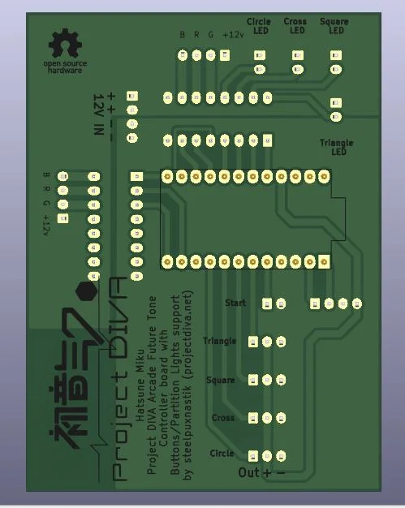

# PDAFT controller with button/partition lights

 

## What is it?
Hatsune Miku Project DIVA Arcade Future Tone controller with button/partition lights support (works fully like on official arcade machine) controlled by game. Controller realizes work with buttons (TRIANGLE, SQUARE, CROSS, CIRCLE, START) and abitily to connect 4 buttons LED and left/right partition 12V RGB LED strip (without slider, for slider I recomend to use LKP https://github.com/Project-Alpaca/LKP). LED info obtained by UART, special PD-Loader plugin activation needed (coming soon).

## Repository contains
Contains [PCB](/PDAFT_BPL_PCB) (KiCad 5.99+  (5.99.0-11737-gca42f31bb5), release build or newer needs to open) and [firmware](/firmware) for Arduino Pro Micro that used in it (use Arduino IDE 1.8 or newer to flash firmware).

## Variations
Board has two possibilities to receive serial data: throught USB (serial) or using TTL (serial1).
Why is that? Because ATMEGA32U4 chip directly supports USB connections and supports USB-Serial connection, but USB-Serial doesn't supports interuptions. Interuptions can be realized only throught direct connection to RX/TX pins using, for example, USB-TTL converter. It theoreticaly can make using gamepad without delays and Serial1 will be used only when new data will appear, but in real work with Serial data optimized as far as I know at this moment and works very fast (direct write to registers used), so needs only few cycles to work with that, so in reality maybe there will be no difference in use USB-Serial or TTL.

To use USB-Serial connection flash `firmware/firmware_USB-Serial/firmware_USB-Serial.ino`

To use TTL - `firmware/firmware_TTL/firmware_TTL.ino`

## Parts needed to use

`PDAFT_BPL_PCB` (1 pcs, order on JLCPCB or somewhere else or make it by yourself)

`JST XH 2pin socket and plug` (5 pcs) for:
  - Start button (desctibed pins from 1 to last, `OUT`, `GND`)
  - Triangle button LED (`+`, `-`)
  - Square button LED (`+`, `-`)
  - Cross button LED (`+`, `-`)
  - Circle button LED (`+`, `-`)

`JST XH 3pin socket and plug` (4 pcs) for:
  - Triangle button (`OUT`, `+` , `-`)
  - Square button (`OUT`, `+` , `-`)
  - Cross button (`OUT`, `+` , `-`)
  - Circle button (`OUT`, `+` , `-`)

`JST XH 4pin socket and plug` (4 pcs)
  - Partition RGB Left (`+12v`, `G`, `R`, `B`)
  - Partition RGB Right (`+12v`, `G`, `R`, `B`)
  - TTL (`RX`, `TX`, `GND`, `+5v`. Do not use 4 pin `+5V` if you connect Arduino with USB)
  - 12V IN (`+`, `+`, `-`,`-`. JST XH connection by datasheet has 3A current rating limitation on one pin, if you'll use long stripes with a lot of LEDs, most likely current will be somewhere around or more then 3A, so better to make paralelized connection to board with two 22 AWG or thicker wire for `12V` (`+`) and `GND` (`-`) from the power socket to board. *I'll uploud picture later about that for you to understand*)
  
 `Arduino ProMicro` (1 pcs)
 
 `12 pin header` (2 pcs, to have possibility to just plug in Arduino ProMicro and change it if needed without soldering, `12 pin header` will be soldered)
 
 `ULN2003` (2 pcs, to use LEDs with it)
 
 `DIP 16 pin socket` (2 pcs, to make possibility to change `ULN2003` without soldering if needed, `DIP 16 pin socket` will be soldered)

## About button connection

By default assumed that you will connect active optical switches ([SHINSANWASWITCH](https://github.com/steelpuxnastik/SHINSANWASWITCH) or OBSA-LHSXF-LN or other) as Triangle, Square, Cross, Circle buttons. If you want to connect passive switches - use connection only to 1 pin (`OUT`) and 3 pin (`-`) and connect nothing to 2 pin (`+`).

## Work in progress
